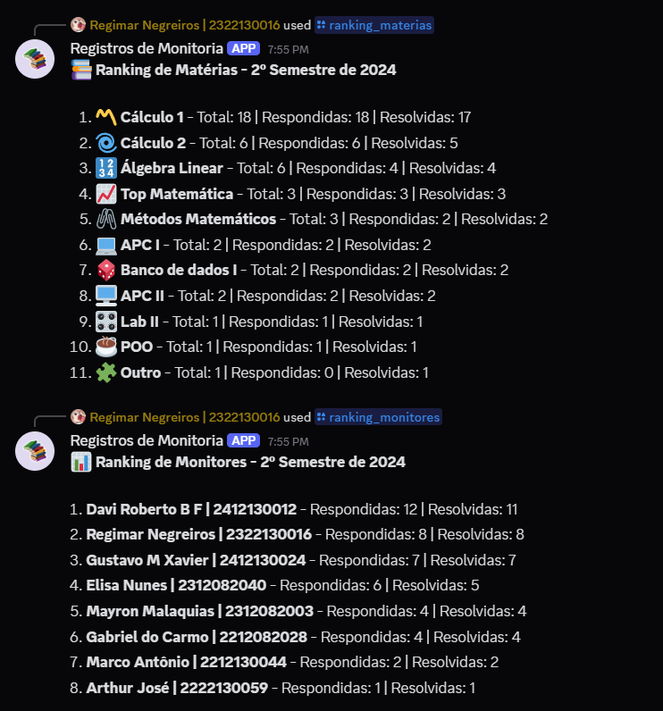

# Bot para registros da monitoria

O **Registros de Monitoria** é um bot desenvolvido para auxiliar no gerenciamento e análise de estatísticas de monitoria dentro de um servidor do Discord. Ele coleta e organiza dados sobre a participação dos monitores em canais de fórum e gerando um ranking baseado em diversas métricas.

O bot foi desenvolvido para o Projeto Integrador 2A de Ciência da Computação pelo IESB.  

Este fork contém a pasta _database_, que possui as contribuições do autor do fork para o bot. Para acessar o bot por completo, [clique aqui](https://github.com/regimarnegreiros/discord-monitoria-bot). 

Para acessar o segundo README, [clique aqui](./database/README.md).

### Exemplo:

